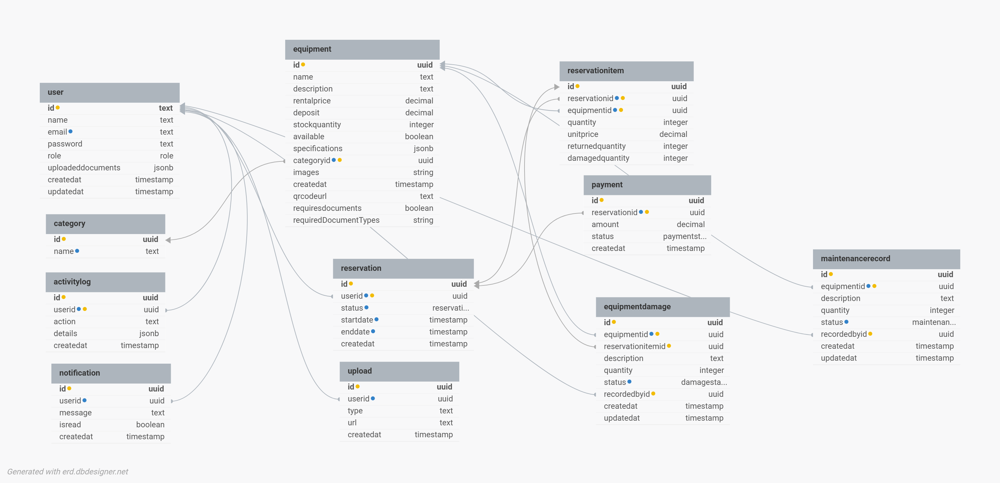

# Entity Relationship Diagram

## Notes
Array-type columns are omitted from this diagram due to dbdesigner.net's 
limited support for PostgreSQL array types:
- `Equipment.images` (String[])
- `Equipment.requiredDocumentTypes` (String[])

See `backend/prisma/schema.prisma` for the complete, authoritative field list.